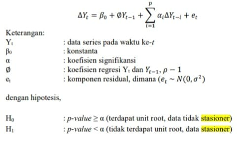
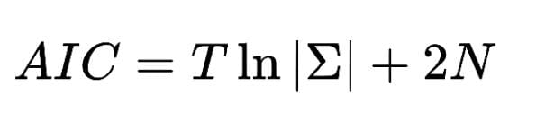
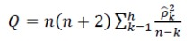

```{r setup, include=FALSE}
knitr::opts_chunk$set(echo = TRUE)
```

## Anggota Kelompok
- G14190007 Dhiffa Fatihah Umami
- G14190026 Nenden Maulidia
- G14190043 Tony Alfan
- G14190047 Alvin Christian
- G14190071 Muhammad Hadyan Rizki

# Praproses Data
## Import Library dan Dataset
Mengimport libraries yang akan digunakan
```{r error=F, warning=F, message=F}
library(knitr)
library(imputeTS)
library(quantmod)
library(aTSA)
library(TSA)
library(forecast)
library(tseries)
library(MASS)
library(lmtest)
```

Import data dan melihat 10 data pertama.
```{r error=F, warning=F, message=F}
start <- as.POSIXct("2017-01-01")
end <- as.POSIXct("2022-03-31")
getSymbols(Symbols = "^JKSE",src = "yahoo", from = start, to = end)
data <- as.data.frame(JKSE)
data$Date <- as.Date(rownames(data))
fulldates <- data.frame(Date=seq(as.Date("2017-01-01"), as.Date("2022-03-31"), by="days"))
ihsg <- merge(fulldates,data,by="Date",all.x=T)

kable(head(ihsg,10), caption="10 baris pertama Harga harian IHSG")
```

## Imputasi Missing Values
```{r error=F, warning=F, message=F}
ihsg.imputed <- na_interpolation(ihsg, option="spline")
ggplot_na_imputations(ihsg$JKSE.Adjusted, ihsg.imputed$JKSE.Adjusted)
```

## Split Data
Membagi data menjadi data training dan testing dengan proporsi 80% training dan 20% testing.
```{r error=F, warning=F, message=F}
ihsg.ts <- ts(ihsg.imputed$JKSE.Adjusted)
ihsg.seasonal <- ts(ihsg.imputed$JKSE.Adjusted, frequency=7)
train.prop <- floor(nrow(ihsg.imputed)*0.8)
test.prop <- nrow(ihsg.imputed)-train.prop

ihsg.train <- head(ihsg.ts, train.prop)
ihsg.test <- tail(ihsg.ts, test.prop)
seasonal.train <- head(ihsg.seasonal, train.prop)
seasonal.test <- tail(ihsg.seasonal, test.prop)
```

# Cek Stasioneritas Data

## Plot Deret Waktu

```{r error=F, warning=F, message=F}
plot(ihsg.imputed$JKSE.Adjusted~ihsg.imputed$Date,
     type = "l", xlab = "Tahun", main = "IHSG Adjusted Closing Price",
     ylab = "IHSG Adjusted Closing Price")
```

```{r error=F, warning=F, message=F}
ts.plot(ihsg.train)
ts.plot(ihsg.test)
```

Terlihat dengan cukup jelas bahwa data yang kita miliki tidak stasioner dalam ragam dan dalam rataan. Perlu dilihat plot ACF/PACF untuk mendukung dugaan tersebut.

## Plot ACF dan PACF


```{r error=F, warning=F, message=F}
acf(ihsg.ts, lag.max = 30 ,main = "Plot ACF IHSG Adjusted Closing Price")
pacf(ihsg.ts, lag.max = 30, main = "Plot PACF IHSG Adjusted Closing Price") 
```

Plot ACF menurun secara eksponensial dan PACF cutoff di lag ke-1. Hal ini menunjukkan bahwa data kita memang tidak stasioner. Akan dikonfirmasi dengan uji formal Augmented Dickey-Fuller Test.

Menurut Stephani (2015), Kestasioneran suatu data diperlukan sebagai asumsi yang harus dipenuhi dalam analisis deret waktu. Stasioneritas memiliki arti bahwa tidak terdapat kenaikan atau penurunan pada data (data berfluktuasi di sekitaran nilai rata-rata yang konstan, tidak tergantung pada waktu dan varians dari fluktuasi tersebut dan tetap konstan setiap waktu).

Uji Augmented Dickey Fuller atau disebut juga Uji Akar Unit (Unit Root Test) merupakan uji yang dilakukan untuk mengetahui data yang diamati merupakan data deret waktu stasioner atau tidak. Data stasioner merupakan data deret waktu yang tidak mengandung akar-akar unit.



Setelah dilakukan pengujian, didapatkan nilai p-value yang kemudian dilakukan evaluasi menggunakan hipotesis diatas untuk menyatakan bahwa Yt bersifat stasioner atau tidak stasioner (Rohmawati dan Wulandari 2020).

```{r error=F, warning=F, message=F}
adf.test(ihsg.ts)
```

Berdasarkan hasil eksplorasi dan uji ADF, cukup bukti menunjukkan bahwa data belum stasioner sehingga akan dicoba dilakukan differencing 1 kali.

Differencing merupakan metode untuk menangani terjadinya ketidakstasioneran data deret waktu pada nilai rataan. Differencing dilakukan dengan menghitung perubahan atau selisih nilai observasi yang nantinya perlu untuk dilakukan pengecekan ulang stasioneritas pada data differencing pertama (Hendrawan 2012). Jika hasil differencing pertama masih belum stasioner, maka akan dilakukan differencing lagi.


```{r error=F, warning=F, message=F}
ihsg.diff <- diff(ihsg.ts, differences = 1)
ts.plot(ihsg.diff)
```

Berdasarkan plot time series terlihat bahwa data sudah stasioner dalam rataan, namun dapat kita lihat bahwa terdapat perbedaan keragaman yang cukup besar dalam periode data ke-1000 hingga 1500. 

```{r error=F, warning=F, message=F}
acf(ihsg.diff, lag.max = 30, main = "Plot ACF yang telah Differencing 1 kali")
pacf(ihsg.diff, lag.max = 30, main = "Plot PACF yang telah Differencing 1 kali") 
adf.test(ihsg.diff)
```

Plot ACF/PACF dan Hasil uji ADF menunjukkan bahwa data telah stasioner sehingga dapat dilanjutkan ke tahap pemodelan. Akan dilakukan eksplorasi untuk menentukan
ordo ARIMA

```{r error=F, warning=F, message=F}
acf(ihsg.diff, lag.max = 30, main = "Plot ACF yang telah Differencing 1 kali")
pacf(ihsg.diff, lag.max = 30, main = "Plot PACF yang telah Differencing 1 kali") 
eacf(ihsg.diff)
```

Kedua plot ACF dan PACF menunjukkan cutoff pada lag ke-1 atau ke-3. Berdasarkan plot ACF kita dapat mendapatkan calon model ARIMA(0,1,1) dan berdasarkan EACF kita dapat menemukan calon model ARIMA(0,1,3), ARIMA(0,1,4), dan ARIMA(1,1,4).

# Pemodelan ARIMA
Akan dilakukan pemodel ARIMA dengan beberapa calon model yang didapat di bagian sebelumnya dan dibandingkan dengan menggunakan AIC.

Auto Regressive Integrated Moving Average (ARIMA) merupakan metode pemodelan pada data deret waktu yang menggunakan data masa lalu dan sekarang dari variabel dependen untuk menghasilkan peramalan jangka pendek (Hendrawan 2012).

Akaike’s Information Criterion (AIC)merupakan suatu metode identifikasi model terbaik yang pertama kali diperkenalkan oleh Akaike. Suatu model dikatakn terbaik jika memiliki nilai AIC terkecil dibandingkan dengan nilai AIC yang lainnya (Maswar 2017).. Akaike Information Criterion (AIC) merupakan salah satu metode yang umum digunakan untuk menghitung panjang lag. Dimana jika panjang lag yang digunakan terlalu kecil akan membuat model tidak dapat digunakan karena kurang mampu menjelaskan hubungannya, namun jika panjang lag yang digunakan terlalu besar maka akan menghasilkan estimasi yang kurang efisien karena berkurangnya degree of freedom.

Akaike Information Criterion (AIC) dirumuskan dalam persamaan berikut:



Dimana |Σ| adalah determinan matriks residual varians atau kovarian dan N adalah jumlah total dari parameter yang diestimasi (Rohmawati dan Wulandari 2020)

```{r error=F, warning=F, message=F}
ihsg.model1 <- Arima(ihsg.ts, order=c(0,1,3), method="ML")
ihsg.model2 <- Arima(ihsg.ts, order=c(0,1,4), method="ML")
ihsg.model3 <- Arima(ihsg.ts, order=c(1,1,4), method="ML")
ihsg.model4 <- Arima(ihsg.ts, order=c(0,1,1), method="ML")
ihsg.model1$aic; ihsg.model2$aic; ihsg.model3$aic; ihsg.model4$aic 
```

Kemudian akan diperiksa tiap model apakah sudah signifikan
```{r error=F, warning=F, message=F}
coeftest(ihsg.model1) 
coeftest(ihsg.model2) 
coeftest(ihsg.model3) 
coeftest(ihsg.model4) 
```

Terlihat bahwa seluruh parameter pada model 4 yaitu ARIMA(0,1,1) sudah signifikan sedangkan model 1, 2, dan 3 hanya sebagian yang signifikan.

Berdasarkan nilai AIC dari ketiga model, nilai AIC model ARIMA(0,1,3) merupakan yang paling kecil.

# Uji Diagnostik
Uji diagnostik dilakukan untuk mengecek apakah model yang dipilih sesuai dengan data secara baik (Rais 2009). Menurut Maswar (2017), pemeriksaan diagnosis (diagnosacheking) dilakukan untuk membuktikan bahwa model tersebut memadai (valid). Dalam pemeriksaan diagnosis ini, dilakukan uji asumsi-asumsi pemodelan, antara lain:


```{r error=F, warning=F, message=F}
ihsg.residual1 <- ihsg.model1$residuals
ihsg.residual2 <- ihsg.model2$residuals
ihsg.residual3 <- ihsg.model3$residuals
ihsg.residual4 <- ihsg.model4$residuals
```

## Normalitas
Uji normalitas residual dilakukan untuk mengetahui kenormalan nilai residual data. Suatu model data dikatakan baik apabila residual data berdistribusi normal. Normalitas residual terjadi apabila histogram residual mempunyai kecenderungan membentuk pola lonceng.

Uji normalitas juga dapat dideteksi dengan Jarque Berra (JB Test) yang memiliki rumus sebagai berikut :


Dimana S adalah skewness, K adalah kurtosis, dan T adalah jumlah data pengamatan. Jika P-value dari Jarque Bera lebih kecil dari tingkat signifikansi α maka menolak H0 (Rosadi 2011)

```{r error=F, warning=F, message=F}
qqnorm(ihsg.residual1)
qqline(ihsg.residual1)
jarque.bera.test(ihsg.residual1)

qqnorm(ihsg.residual2)
qqline(ihsg.residual2)
jarque.bera.test(ihsg.residual2)

qqnorm(ihsg.residual3)
qqline(ihsg.residual3)
jarque.bera.test(ihsg.residual3)

qqnorm(ihsg.residual4)
qqline(ihsg.residual4)
jarque.bera.test(ihsg.residual4)
```

Berdasarkan qq-plot dan uji formal Jarque Bera, sisaan keempat model cenderung tidak menyebar normal sehingga asumsi normalitas tidak terpenuhi bagi keempat model.

## Kehomogenan Ragam
Uji ini dilakukan dengan tujuan untuk mengetahui apakah data mengandung heteroskedastisitas atau tidak (varians residual homogen atau tidak). Hal ini dapat diketahui melalui correlogram of residual squared. Jika correlogram tersebut menunjukkan adanya plot ACF dan PACF yang signifikan pada lag-lag pertama maka varians residual tidak konstan. Jika sebaliknya maka varians residul konstan.

```{r error=F, warning=F, message=F}
acf(ihsg.residual1)
pacf(ihsg.residual1)

acf(ihsg.residual2)
pacf(ihsg.residual2)

acf(ihsg.residual3)
pacf(ihsg.residual3)

acf(ihsg.residual4)
pacf(ihsg.residual4)
```

Berdasarkan plot ACF dan PACF, terlihat bahwa nilai ACF maupun PACF tidak ada yang signifikan di lag awal, sehingga dapat disimpulkan bahwa asumsi kehomogenan ragam terpenuhi bagi ARIMA(0,1,3), ARIMA(0,1,4), ARIMA(1,1,4). ARIMA(0,0,1) tidak lolos asumsi kehomogenan ragam karena ada nilai ACF/PACF yg signifikan di lag awal.

## Autokorelasi
Uji Autokorelasi dilakukan untuk mengetahui apakah residual data 
mengandung autokorelasi atau tidak. Hal ini dapat dilihat melalui correlogram of residuals. Jika correlogram tersebut menunjukkan adanya plot ACF dan PACF yang signifikan pada lag-lag awal, maka residual mengandung autokorelasi. Jika sebaliknya, maka residual tidak mengandung autokorelasi. Selain melihat plot, uji non-autokorelasi juga dapat diuji menggunakan  Ljung-Box Q-Test. Menurut Ghozali (2011) menyatakan kriteria pengujian Ljung-Box Q-Test sebagai berikut jika jumlah lag yang signifikan lebih dari dua, maka dinyatakan terjadi autokorelasi, jika jumlah lag yang signifikan tidak lebih dari dua, maka dinyatakan tidak terjadi autokorelasi (pasar efisien bentuk lemah). Pengujian metode Ljung-Box Q-Test dilakukan dengan rumus sebagai berikut :



```{r error=F, warning=F, message=F}
Box.test(ihsg.residual1, type="Ljung")
Box.test(ihsg.residual2, type="Ljung")
Box.test(ihsg.residual3, type="Ljung")
Box.test(ihsg.residual4, type="Ljung")
```

Berdasarkan hasil Ljung-Box test, terlihat bahwa data telah memenuhi asumsi tidak adanya autokorelasi.

# Transformasi 
Karena asumsi normalitas tidak terpenuhi pada semua model, maka akan coba dilakukan transformasi BoxCox terhadap data Harga Adjusted Closing IHSG harian.

Menurut Draper dan Smith (1998) transformasi Box-Cox merupakan transformasi pangkat pada variabel respons yang dikembangkan oleh Box dan Cox, yang bertujuan untuk menormalkan data, melinearkan model regresi dan menghomogenkan varians. Transformasi Box-Cox hanya diberlakukan pada variabel respons Y yang bertanda positif. Prosedur utama yang dilakukan pada Transformasi Box-Cox adalah menduga parameter  , yang dilakukan dengan mencari nilai Wt dan Vt melalui persamaan:


```{r error=F, warning=F, message=F}
bc <- boxcox(ihsg.ts ~ 1)
(lambda <- bc$x[which.max(bc$y)])
```

```{r error=F, warning=F, message=F}
tfed.ts <- ihsg.ts^(lambda)
train.prop <- floor(nrow(ihsg.imputed)*0.8)
test.prop <- nrow(ihsg.imputed)-train.prop

tfed.train <- head(tfed.ts, train.prop)
tfed.test <- tail(tfed.ts, test.prop)
```

```{r error=F, warning=F, message=F}
ts.plot(tfed.ts)
```

Terlihat bahwa plot deret waktu dari data yang telah ditransformasi belum stasioner maka tetap perlu dilakukan differencing.

```{r error=F, warning=F, message=F}
tfed.diff <- diff(tfed.ts, differences=1)
ts.plot(tfed.diff)
adf.test(tfed.diff)
```

Akan Kembali dilakukan pemodelan terhadap data yang telah ditransformasi

```{r error=F, warning=F, message=F}
ihsg.tfed.model1 <- Arima(tfed.ts, order=c(0,1,3), method="ML")
ihsg.tfed.model2 <- Arima(tfed.ts, order=c(0,1,4), method="ML")
ihsg.tfed.model3 <- Arima(tfed.ts, order=c(1,1,4), method="ML")
ihsg.tfed.model4 <- Arima(tfed.ts, order=c(0,1,1), method="ML")
ihsg.tfed.model1$aic; ihsg.tfed.model2$aic; ihsg.tfed.model3$aic; ihsg.tfed.model4$aic
```

Didapatkan bahwa model ARIMA(0,1,3) pada data yang telah ditransformasi tetap memiliki nilai AIC paling kecil. Akan kembali diperiksa koefisien dari tiap model.

```{r error=F, warning=F, message=F}
coeftest(ihsg.tfed.model1) 
coeftest(ihsg.tfed.model2) 
coeftest(ihsg.tfed.model3) 
coeftest(ihsg.tfed.model4) 
```

# Uji diagnostik data yang telah ditransformasi

```{r error=F, warning=F, message=F}
ihsg.tfed.residual1 <- ihsg.tfed.model1$residuals
ihsg.tfed.residual2 <- ihsg.tfed.model2$residuals
ihsg.tfed.residual3 <- ihsg.tfed.model3$residuals
ihsg.tfed.residual4 <- ihsg.tfed.model4$residuals
```

## Normalitas

```{r error=F, warning=F, message=F}
qqnorm(ihsg.tfed.residual1)
qqline(ihsg.tfed.residual1)
jarque.bera.test(ihsg.tfed.residual1)

qqnorm(ihsg.tfed.residual2)
qqline(ihsg.tfed.residual2)
jarque.bera.test(ihsg.tfed.residual2)

qqnorm(ihsg.tfed.residual3)
qqline(ihsg.tfed.residual3)
jarque.bera.test(ihsg.tfed.residual3)

qqnorm(ihsg.tfed.residual4)
qqline(ihsg.tfed.residual4)
jarque.bera.test(ihsg.tfed.residual4)
```

Berdasarkan qq-plot dan uji formal Jarque Bera, sisaan data yang telah ditransformasi cenderung tidak menyebar normal sehingga asumsi normalitas tetap tidak terpenuhi.

## Kehomogenan Ragam

```{r error=F, warning=F, message=F}
acf(ihsg.tfed.residual1)
pacf(ihsg.tfed.residual1)

acf(ihsg.tfed.residual2)
pacf(ihsg.tfed.residual2)

acf(ihsg.tfed.residual3)
pacf(ihsg.tfed.residual3)

acf(ihsg.tfed.residual4)
pacf(ihsg.tfed.residual4)
```

Berdasarkan plot ACF dan PACF, terlihat bahwa nilai ACF maupun PACF tidak ada yang signifikan di lag awal bagi ARIMA(0,1,3), ARIMA(0,1,4), ARIMA(1,1,4), sehingga dapat disimpulkan bahwa asumsi kehomogenan ragam terpenuhi bagi . ARIMA(0,0,1) tidak lolos asumsi kehomogenan ragam karena ada nilai ACF/PACF yg signifikan di lag awal.

## Autokorelasi

```{r error=F, warning=F, message=F}
Box.test(ihsg.tfed.residual1, type="Ljung")
Box.test(ihsg.tfed.residual2, type="Ljung")
Box.test(ihsg.tfed.residual3, type="Ljung")
Box.test(ihsg.tfed.residual4, type="Ljung")
```

Berdasarkan hasil Ljung-Box test, terlihat bahwa data telah memenuhi asumsi tidak adanya autokorelasi.

Karena hasil uji diagnostik pada data yang telah ditransformasi juga tidak lolos asumsi normalitas sisaan maka tidak bisa dilakukan peramalan.

# Sesonal ARIMA (SARIMA)
Model SARIMA adalah model time series dengan pola musiman (seasonal). Model ini dinotasikan dengan ARIMA (p,d,q)(P,D,Q)s. Menurut Halim dan Bisono (2008), model SARIMA dapat juga dituliskan menggunakan lag operator sebagai berikut. 


Dimana: 
P, d, dan q : orde-orde non-musiman AR, pembeda, dan MA 
P, D, dan Q : orde- orde musiman AR, pembeda, dan MA 
Yt : merepresentasikan data deret waktu pada periode ke-t 
S : rangka musiman

```{r error=F, warning=F, message=F}
ihsg.seasonal <- ts(ihsg.imputed$JKSE.Adjusted, frequency=7)
ihsg.seasonal.diff <- diff(diff(ihsg.seasonal,1),7)
ts.plot(ihsg.seasonal.diff)
```

Karena pada bagian sebelumnya kita telah menyadari bahwa perlu dilakukan differencing non-seasonal sebanyak 1 kali agar data stasioner, maka akan kembali dilakukan differencing. 

```{r error=F, warning=F, message=F}
par(mfrow=c(1,2))
acf(ihsg.seasonal.diff, lag.max = 14, main="ACF lag max = 14") 
acf(ihsg.seasonal.diff, lag.max = 210, main="ACF lag max = 210") 
pacf(ihsg.seasonal.diff, lag.max = 14, main="PACF lag max = 14")
pacf(ihsg.seasonal.diff, lag.max = 210, main="PACF lag max = 210")
par(mfrow = c(1,1))
```

Berdasarkan plot ACF terlihat Cutoff di lag ke-1 atau ke-3. selain itu komponen musiman di ACF cutoff di lag ke-365 (satu lag musiman). MA(1) atau MA(3) non musiman dan MA(1) musiman.

Plot PACF menunjukkan cutoff di lag ke-1 atau ke-4 dan nilai PACF menurun pada lag musiman (namun secara perlahan) atau tail off, maka memperkuat dugaan bahwa model yang cocok merupakan MA(1) musiman.  

```{r error=F, warning=F, message=F}
eacf(ihsg.seasonal.diff)
```

Hasil EACF menunjukkan bahwa beberapa model yang dapat digunakan adalah ARIMA(0,1,3)(0,1,1)365, ARIMA(0,1,4)(0,1,1)365, dan ARIMA(1,1,4)(0,1,1)365.   

## Pemodelan
```{r error=F, warning=F, message=F}
ihsg.seasonal.model1 <- Arima(ihsg.seasonal, order=c(0,1,3), seasonal=c(0,1,1), method="ML")
ihsg.seasonal.model2 <- Arima(ihsg.seasonal, order=c(0,1,4), seasonal=c(0,1,1), method="ML")
ihsg.seasonal.model3 <- Arima(ihsg.seasonal, order=c(1,1,4), seasonal=c(0,1,1), method="ML")
ihsg.seasonal.model4 <- Arima(ihsg.seasonal, order=c(0,1,1), seasonal=c(0,1,1), method="ML")
ihsg.seasonal.model1$aic; ihsg.seasonal.model2$aic; ihsg.seasonal.model3$aic; ihsg.seasonal.model4$aic
```

Berdasarkan model SARIMA yang dibuat, terlihat bahwa nilai AIC paling kecil adalah model ARIMA(0,1,3)(0,1,1)7

Akan diperiksa koefisien dari tiap model
```{r error=F, warning=F, message=F}
coeftest(ihsg.seasonal.model1) 
coeftest(ihsg.seasonal.model2) 
coeftest(ihsg.seasonal.model3) 
coeftest(ihsg.seasonal.model4) 
```
Kita dapat lihat bahwa seluruh koefisien ARIMA(0,1,1)(0,1,1)7 signifikan sedangkan yang lain hanya sebagian yang signifikan. 

## Uji Diagnostik
```{r error=F, warning=F, message=F}
ihsg.seasonal.residual1 <- ihsg.seasonal.model1$residuals
ihsg.seasonal.residual2 <- ihsg.seasonal.model2$residuals
ihsg.seasonal.residual3 <- ihsg.seasonal.model3$residuals
ihsg.seasonal.residual4 <- ihsg.seasonal.model4$residuals
```

## Normalitas
```{r error=F, warning=F, message=F}
qqnorm(ihsg.seasonal.residual1)
qqline(ihsg.seasonal.residual1)
jarque.bera.test(ihsg.seasonal.residual1)

qqnorm(ihsg.seasonal.residual2)
qqline(ihsg.seasonal.residual2)
jarque.bera.test(ihsg.seasonal.residual2)

qqnorm(ihsg.seasonal.residual3)
qqline(ihsg.seasonal.residual3)
jarque.bera.test(ihsg.seasonal.residual3)

qqnorm(ihsg.seasonal.residual4)
qqline(ihsg.seasonal.residual4)
jarque.bera.test(ihsg.seasonal.residual4)
```

Berdasarkan qq-plot dan uji formal Jarque Bera, sisaan cenderung tidak menyebar normal sehingga kembali kita temui bahwa asumsi normalitas tidak terpenuhi.

## Kehomogenan Ragam

```{r error=F, warning=F, message=F}
acf(ihsg.seasonal.residual1)
pacf(ihsg.seasonal.residual1)

acf(ihsg.seasonal.residual2)
pacf(ihsg.seasonal.residual2)

acf(ihsg.seasonal.residual3)
pacf(ihsg.seasonal.residual3)

acf(ihsg.seasonal.residual4)
pacf(ihsg.seasonal.residual4)
```

Berdasarkan plot ACF dan PACF, terlihat bahwa nilai ACF maupun PACF tidak ada yang signifikan di lag awal, sehingga dapat disimpulkan bahwa asumsi kehomogenan ragam terpenuhi.

## Autokorelasi

```{r error=F, warning=F, message=F}
Box.test(ihsg.seasonal.residual1, type="Ljung")
Box.test(ihsg.seasonal.residual2, type="Ljung")
Box.test(ihsg.seasonal.residual3, type="Ljung")
Box.test(ihsg.seasonal.residual4, type="Ljung")
```

Berdasarkan hasil Ljung-Box test, terlihat bahwa data telah memenuhi asumsi tidak adanya autokorelasi.

# Overfitting

Akan dicoba untuk melakukan overfitting dari model SARIMA dari model yang seluruh koefisiennya signifikan ARIMA(0,1,1)(0,1,1)7 dan memiliki AIC kecil dibanding model ARIMA non-seasonal yaitu:

- ARIMA(1,1,1)(0,1,1)7
- ARIMA(0,1,2)(0,1,1)7

```{r error=F, warning=F, message=F}
ihsg.ovt.model1 <- Arima(ihsg.seasonal, order=c(1,1,1), seasonal=c(0,1,1), method="ML")
ihsg.ovt.model2 <- Arima(ihsg.seasonal, order=c(0,1,2), seasonal=c(0,1,1), method="ML")
ihsg.ovt.model1$aic; ihsg.ovt.model2$aic;

coeftest(ihsg.ovt.model1) 
coeftest(ihsg.ovt.model2)

ihsg.ovt.residual1 <- ihsg.ovt.model1$residuals
ihsg.ovt.residual2 <- ihsg.ovt.model2$residuals
```

Dari kedua model overfitting, tidak ada yang seluruh parameternya signifikan. Maka uji diagnostik dan peramalan tidak akan dilakukan

# Peramalan
Maka akan dilakukan peramalan dengan 3 model berikut yang kemudian akan dibandingkan nilai galat peramalannya:

- ARIMA(0,1,1) karena seluruh koefisiennya signifikan
- ARIMA(0,1,3) karena memiliki nilai AIC paling kecil diantara model ARIMA lainnya
- ARIMA(0,1,1)(0,1,1)7 karena seluruh koefisiennya signifikan
- ARIMA(0,1,3)(0,1,1)7 karena memiliki nilai AIC paling kecil diantara seluruh model yang telah dicobakan

```{r error=F, warning=F, message=F}
ihsg.forecast1 <- forecast(Arima(ihsg.train, order=c(0,1,1), method="ML"), 
                          h=test.prop)
plot(ihsg.forecast1)
lines(ihsg.test)
accuracy(ihsg.forecast1$mean, ihsg.test)


ihsg.forecast2 <- forecast(Arima(ihsg.train, order=c(0,1,3), method="ML"), 
                          h=test.prop)
plot(ihsg.forecast2)
lines(ihsg.test)
accuracy(ihsg.forecast2$mean, ihsg.test)

ihsg.seasonal.forecast3 <- forecast(Arima(seasonal.train, order=c(0,1,1), seasonal=c(0,1,1), method="ML"), 
                          h=test.prop)
plot(ihsg.seasonal.forecast3)
lines(seasonal.test)
accuracy(ihsg.seasonal.forecast3$mean, seasonal.test)

ihsg.seasonal.forecast4 <- forecast(Arima(seasonal.train, order=c(0,1,3), seasonal=c(0,1,1), method="ML"), 
                          h=test.prop)
plot(ihsg.seasonal.forecast4)
lines(seasonal.test)
accuracy(ihsg.seasonal.forecast4$mean, seasonal.test)
```

# Kesimpulan
Berdasarkan seluruh model yang telah kelompok kami coba, baik ARIMA(0,1,1), ARIMA(0,1,3), ARIMA(0,1,3), Seasonal ARIMA dengan ARIMA(0,1,1)(0,1,1)7, dan Seasonal ARIMA dengan ARIMA(0,1,3)(0,1,1)7 didapatkan seluruhnya tidak lolos uji asumsi normalitas pada uji diagnostik (termasuk model yang telah ditransformasi). Maka perlu diambil langkah yang dapat menyelesaikan masalah ketidaknormalan sisaan.

Berdasarkan nilai RMSE, MAE, dan MAPE dapat dilihat bahwa ARIMA(0,1,3)(0,1,1)7 merupakan model peramalan yang paling baik untuk dataset ini.

# Daftar Pustaka
Aldoko Listiaji Putra, Aminuddin Kasdi, Waspodo Tjipto Subroto. 2019. PENGARUH MEDIA GOOGLE EARTH TERHADAP HASIL BELAJAR BERDASARKAN KEAKTIFAN SISWA KELAS IV TEMA INDAHNYA NEGERIKU DI SEKOLAH DASAR. Jurnal Kajian Pendidikan dan Hasil Penelitian. 5(3): 5.

Anik Rufaidah, Muhamad Afif Effindi. 2018. ANALISIS TIME SERIES UNTUK MENENTUKAN MODEL TERBAIK PRODUK SONGKOK NASIONAL DI KABUPATEN GRESIK. Prosiding Seminar Nasional Matematika dan Terapannya 2018. 

Anselin, L. 1988. Spatial Econometrics: Methods and Models. Kluwer Academic Publishers. The Netherlands

Arif Subekti. 2010. Pengelolaan Kas Daerah Untuk Mendukung Peningkatan Pendapatan Asli Daerah pada Pemerintah Kabupaten Pekalongan. Jurnal Kebijakan Ekonomi. 6(1):.

Draper, N. R. & Smith, H., 1998. Applied regression Analysis. Third ed. New York: John Wiley.

Ghozali, I. (2011). Aplikasi Analisis Multivariate dengan Program SPSS. Semarang: BP Universitas Diponegoro

Halim S., Bisono IN. 2008. Automatic Seasonal Autoregressive Moving Average Models and Unit Root Test Detection. International Journal of Management Science and Engineering Management. 3(4): 266-274.

Hendrawan B. 2012. Penerapan Model ARIMA Dalam Memprediksi IHSG. Jurnal Intergrasi. 4(2):205-211.

Maswar. 2017. Analisis time series model arma untuk memprediksi jumlah santri pp salafiyah syafi'iyah sukorejo 2017-2021. Jurnal Pengembangan Pemikiran dan Kebudayaan. 11(1): 59-86.

Purwanto.(2011). Statistik untuk Penelitian.Yogyakarta : Pustaka Pelajar

Rais. 2009. Pemodelan data time series dengan metode box-jenknis. Jurnal Ilmiah Matematika dan Terapan. 6(1): 1-10.

Real-Statistic. (2019). Kolomogorov – Smirnov Test For Normality. Diakses 2020.http://www.real-statistics.com/testsnormality-and-symmetry/statistical-testsnormality-symmetry/kolmogorov-smirnovtest/

Rohmawati AA, Wulandari A. 2020. Prediksi pergerakan harga saham pt. astra internasional tbk menggunakan vector auto regressive (var) stasioner dan logistic regression. Jurnal of Engineering. 7(3): 2614-2626.

Rosadi, D. 2011. Analisis Ekonometrika dan Runtun Waktu Terapan dengan R. Andi. Yogyakarta

Stephani CA. 2015. Peramalan Inflasi Nasional Berdasarkan Faktor Ekonomi Makro Menggunakan Pendekatan Time Series Klasik dan Anfis. [skripsi]. Surabaya (ID): Institut Teknologi Sepuluh Nopember.